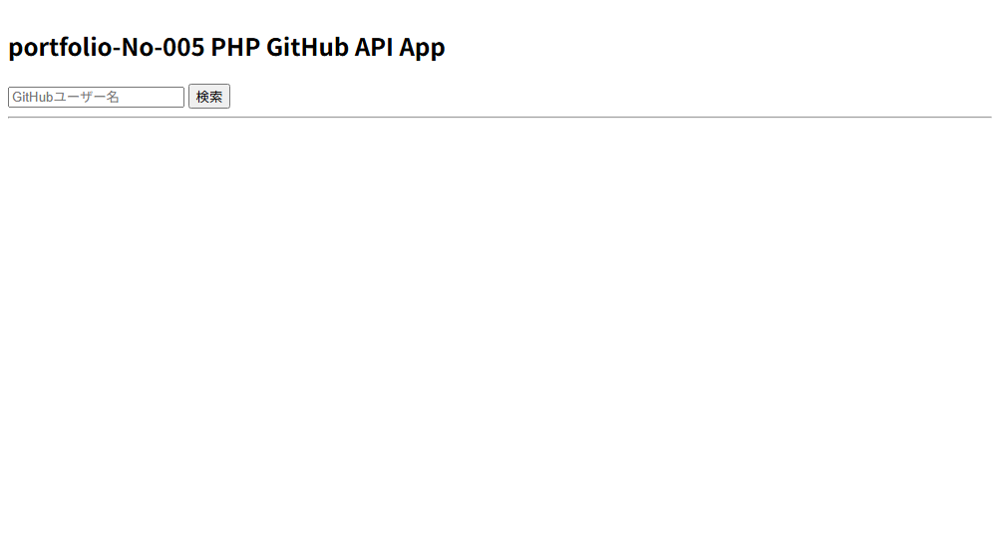
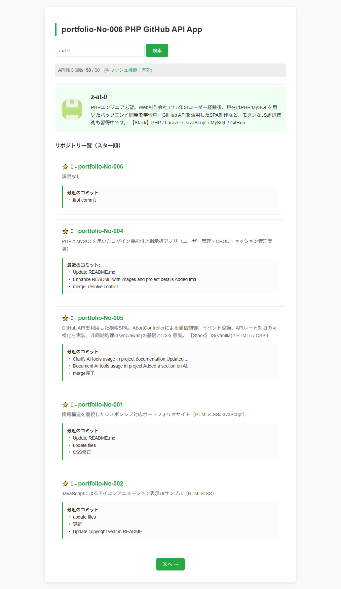
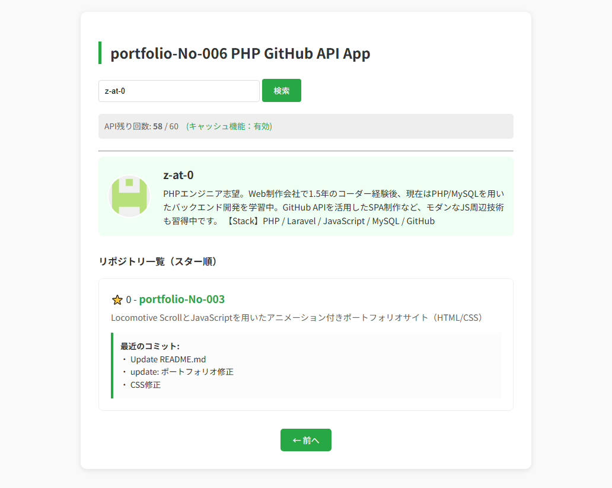
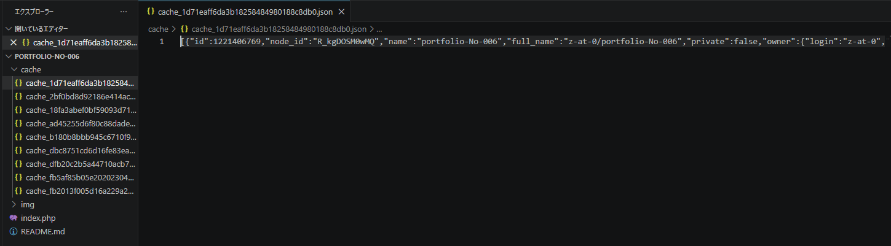

# portfolio-No-006: PHP GitHub API App (Cache & GC Logic)

## 概要
GitHub APIを利用して、ユーザー情報やリポジトリを検索・表示するPHPアプリケーションです。
外部APIの「1時間60回」という利用制限に対し、サーバーサイドでキャッシュ機構を自作し、リソースの最適化を図ることで実用性を高めた設計を重視しています。

## 画面イメージ

### 1. トップページ

*シンプルな検索画面デザイン。*

### 2. APIレート制限の可視化及び検索結果・リポジトリ一覧

*現在のAPI残り回数と、キャッシュ機能が有効であることをユーザーに提示。*
*スター順のソート、キャッシュされたコミット履歴、スマートなページネーション。*
*検索結果に対して「次へ」や「前へ」のUIも考慮。*

### 3. サーバーサイド・キャッシュ管理

*自動生成されるcacheフォルダと、保存されたJSON形式のレスポンスデータ。*

## 主な機能
- **GitHubユーザー検索**: アカウント情報、アイコン、自己紹介（Bio）の取得
- **リポジトリ管理**: PHPの `usort` によるスター数順のソート、ページネーション表示
- **詳細プレビュー**: 各リポジトリの最新3件のコミット履歴をキャッシュ連携で高速取得
- **自作キャッシュ機構**: APIレスポンスをファイル保存し、同一リクエストのAPI消費を10分間ゼロ化
- **自動ガベージコレクション (GC)**: 24時間経過した古いキャッシュを10%の確率で自動削除

## 使用技術
- **使用言語**: PHP (8.2.12), HTML, CSS
- **技術要素**: 
    - PHPファイルシステム操作 (`file_put_contents`, `filemtime`, `unlink`)
    - 確率的アルゴリズムによる自動クリーンアップ
    - `stream_context_create` によるHTTPリクエスト制御
- **API**: GitHub REST API

## 設計方針
単にAPIを叩くだけでなく、「限られたリソース（API制限）をいかにバックエンドの工夫で守るか」という実務的な課題解決を意識して設計しました。
データベースを使わずに軽量なファイルベースのキャッシュシステムを構築し、サーバー容量を圧迫しないよう自律的な掃除機能（GC）を盛り込むことで、運用コストの低い構成を目指しました。

## 動作環境
本アプリケーションはPHPを使用しているため、ローカル開発環境（XAMPP）等で動作します。

## セットアップ方法
1. リポジトリをクローン
   `git clone https://github.com/z-at-0/portfolio-No-006.git`
2. XAMPP等のローカル環境（Apache / PHP）を起動
3. `htdocs` フォルダ等に配置し、ブラウザでアクセス
   `http://localhost/portfolio-No-006/`
   ※ 実行時に `cache/` フォルダが自動生成されます。

## ディレクトリ構成

portfolio-No-006
├ index.php      (メインロジック & UI)
├ cache/         (自動生成：APIレスポンスのキャッシュ保存先)
└ img/           (README用スクリーンショット)

## 学習・AI活用について
本プロジェクトでは、実装理解およびデバッグ補助の目的でAIツール（Gemini）を活用しています。

### ■ 活用範囲
- サーバーサイド・キャッシュ（ファイルベース）の設計思想と実装方法の検討
- 確率的なアルゴリズムを用いたガベージコレクション（GC）のロジック構築
- ページネーションにおける、ユーザー視点に立った動的な表示条件の最適化
- PHP特有の関数（stream_context_create 等）の仕様確認とデバッグ支援

### ■ 主体性について
コードはすべて手動で入力し、一行ずつ内容を確認しながら理解を進めています。
キャッシュファイルの自動生成や有効期限、条件に応じたページ番号の非表示ロジックなど、自身の理想の挙動になるまで手動で修正を繰り返し、自分の技術として吸収した上で採用しています。

### ■ 補足
004（DB連携）や005（JS非同期）の学習を経て、006では「外部制約（API制限）を技術でどう回避するか」というバックエンドの課題解決力に重点を置いています。AIを単なるツールとしてではなく、高度なロジックを体系的に学ぶための「対話型リファレンス」として活用しています。

© 2026 Y.K
